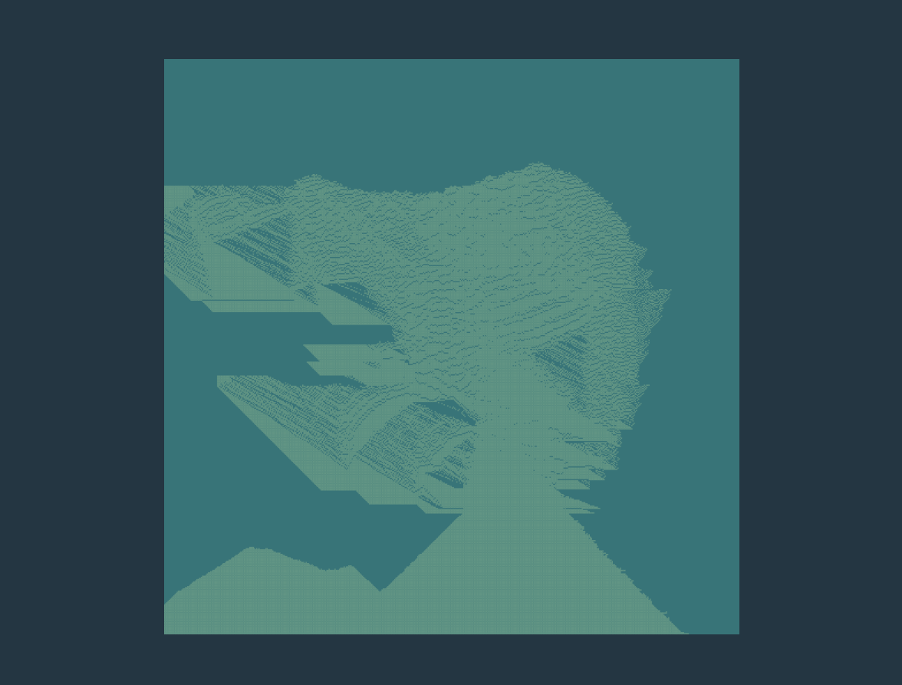

### Quick Start

Clone the repository:

```bash
git clone https://github.com/RafhaelHailar/Falling-Sand-Simulator.git
```

Go to the folder:

```bash
cd Falling-Sand-Simulator
```

Install Dependencies:

```bash
npm i
```

Run in Development:

```bash
npm run dev
```

### Image


